 

## whoami

I'm a B.Tech CSE student who mostly builds two kinds of things: **web apps** and **anything involving orbits**. Satellite simulation, debris tracking, mission-control dashboards — it started as a side interest and quietly became most of my GitHub.

Comfortable across the stack, happiest somewhere near the systems layer. Currently learning **TypeScript** and looking for open source to contribute to.

## Stack

## Things I've built

**[NEXUS](https://github.com/Harshcodes04/NEXUS)** — Mission-control platform for satellite constellations. Orbital propagation, collision avoidance, live telemetry. `JavaScript`

**[Debris-Detection](https://github.com/Harshcodes04/Debris-Detection)** — Orbital debris detection pipeline. `Python`

**[cosmovoid](https://github.com/Harshcodes04/cosmovoid)** — A single place for space enthusiasts and educators instead of ten scattered ones. `JavaScript`

**[PrepWise](https://github.com/Harshcodes04/PrepWise)** — Technical interview prep that generates questions tailored to you. `TypeScript`

**[community-era](https://github.com/Harshcodes04/community-era)** — Civic issue reporting, starting with potholes. `JavaScript`

